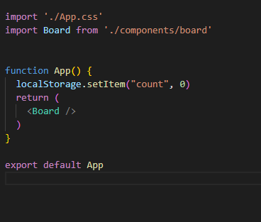
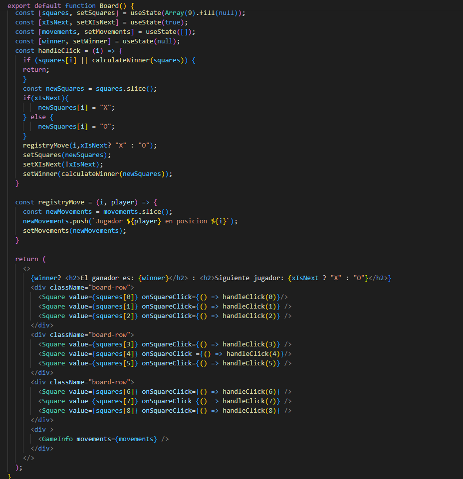
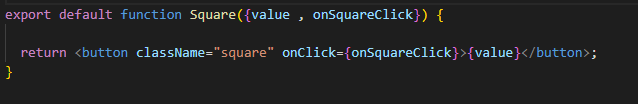
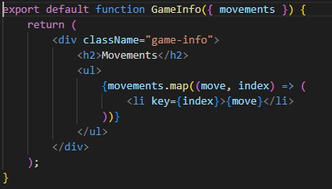
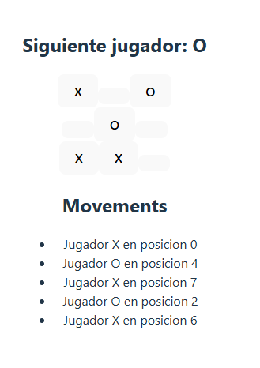

# Tic Tac Toe
## Fuente del tutorial
Este juego fue creado con base en el siguiente tutorial:
[Tutorial Tic Tac Toe de React](https://react.dev/learn/tutorial-tic-tac-toe)

## Desarrollo
El proyecto fue desarrollado con React y Vite, aplicando componentes reutilizables para organizar la lógica y la interfaz del juego.

### `App`
Es el componente principal de la aplicación. Se encarga de renderizar el tablero y de iniciar la experiencia del juego.



### `Board`
Es el componente central del juego. Administra el estado de las casillas, controla los turnos de los jugadores, registra los movimientos y determina si existe un ganador.



### `Square`
Representa cada casilla del tablero. Recibe el valor de la posición y la función que se ejecuta al hacer clic.



### `GameInfo`
Muestra el historial de movimientos realizados durante la partida.



### `calculateWinner`
Función auxiliar usada para evaluar las combinaciones posibles y determinar si algún jugador ganó la partida.

## Cómo correr
Deben tener instalado node.js
1. Instalar dependencias:
	```bash
	npm install
	```

2. Ejecutar el proyecto en modo desarrollo:
	```bash
	npm run dev
	```

3. Abrir la URL que aparece en la terminal.

## Funcionalidad



El juego funciona por turnos, lista los movimientos y cuando encuentra un ganador lo muestra en la parte superior.